# System Gap Analysis and Improvement Plan

## Purpose

This document identifies gaps, missing features, and improvement opportunities in the Kafkasder-panel system based on comprehensive codebase analysis. It provides strategic recommendations for enhancing the system's capabilities, stability, and production readiness.

## Current System Status

The system is at **v1.0.0 Production Release** with demo mode enabled for certain features. The core infrastructure is solid, with modern technology stack (Next.js 16, React 19, Convex, TypeScript) and essential modules implemented.

### Implemented Features

- Authentication and authorization with RBAC
- Beneficiary management system
- Donation tracking (standard donations and kumbara system with GPS)
- Scholarship management
- Financial record keeping
- Task and meeting management
- Internal messaging system
- Analytics and reporting dashboards
- Performance monitoring
- API caching system
- Security mechanisms (CSRF, rate limiting, data masking)

## Critical Gaps

### 1. Mock Data Dependencies

**Impact Level:** High
**Priority:** Critical

**Current Situation:**

Several key pages rely on mock data instead of real backend integration, limiting production usability.

**Affected Components:**

| Page/Module                                                             | Mock Data Usage                   | Impact                                 |
| ----------------------------------------------------------------------- | --------------------------------- | -------------------------------------- |
| Analytics Dashboard (`src/app/(dashboard)/analitik/page.tsx`)           | Complete mock data for all charts | Users cannot view real analytics       |
| General Dashboard (`src/app/(dashboard)/genel/page.tsx`)                | Stats widgets using mock counts   | Inaccurate system overview             |
| Financial Reports (`src/app/(dashboard)/fon/raporlar/page.tsx`)         | Mock report data                  | Cannot generate real financial reports |
| Income/Expense Records (`src/app/(dashboard)/fon/gelir-gider/page.tsx`) | Mock finance records              | Cannot track actual transactions       |

**Required Actions:**

- Develop Convex queries for analytics event/metrics aggregation
- Implement real-time count queries for dashboard statistics
- Connect financial reports to `finance_records` table
- Remove or make demo mode optional after implementation

**Expected Outcome:**

System becomes fully production-ready with accurate, real-time data presentation across all modules.

### 2. External Communication Services

**Impact Level:** High
**Priority:** High

**Current Situation:**

Email and SMS services are partially implemented but lack complete integration.

**Email Service Gaps:**

- Error notification emails not configured (`src/lib/error-notifications.ts:159`)
- Missing email templates for critical notifications
- No automated admin alerts for system errors
- Email service integration incomplete

**SMS Service Gaps:**

- User phone number data structure undefined
- SMS sending functionality exists but lacks user contact integration
- No phone field in users schema
- Beneficiary phone numbers not properly linked to messaging system

**Required Actions:**

**For Email:**

- Configure email service provider (SMTP/SendGrid/etc.)
- Create email templates for error notifications, system alerts, user notifications
- Implement automated email delivery for critical events
- Add email queue management for reliability

**For SMS:**

- Extend users schema with phone number field
- Implement phone number validation (Turkish mobile format: +905XXXXXXXXX)
- Create user-to-phone mapping in database
- Complete SMS delivery integration with Twilio service

**Expected Outcome:**

Complete communication capability for user notifications, error alerts, and system messages.

### 3. Export Functionality

**Impact Level:** Medium
**Priority:** Medium

**Current Situation:**

Users cannot export reports in standard formats (PDF, Excel, CSV), limiting data portability and reporting capabilities.

**Missing Features:**

- PDF export for financial reports
- Excel export for tabular data
- CSV export for data analysis
- Customizable export templates
- Bulk export capabilities

**Required Actions:**

- Implement PDF generation using jsPDF (already in dependencies)
- Add Excel export library (xlsx/exceljs)
- Create export templates for each report type
- Implement export controls in relevant pages
- Add export history tracking

**Export Use Cases:**

| Report Type       | Format    | Content                                         |
| ----------------- | --------- | ----------------------------------------------- |
| Financial Reports | PDF       | Monthly income/expense summary with charts      |
| Beneficiary List  | Excel/CSV | Complete beneficiary data with filters          |
| Donation Records  | Excel/CSV | Donation history with donor information         |
| Meeting Minutes   | PDF       | Meeting details with decisions and action items |
| Audit Logs        | CSV       | Complete audit trail for compliance             |

**Expected Outcome:**

Users can generate and download professional reports in multiple formats for offline analysis and sharing.

## Functional Improvements

### 4. Enhanced Testing Coverage

**Impact Level:** Medium
**Priority:** Medium

**Current Situation:**

Test coverage exists but has gaps in critical areas.

**Coverage Gaps:**

| Area              | Current Status                               | Gap                                            |
| ----------------- | -------------------------------------------- | ---------------------------------------------- |
| Unit Tests        | Basic coverage for utilities and validations | Missing tests for complex business logic       |
| Integration Tests | Limited to beneficiary sanitization          | Need tests for workflows, multi-step processes |
| E2E Tests         | Core flows covered                           | Missing edge cases, error scenarios            |
| API Tests         | Basic endpoint testing                       | Incomplete permission/authorization testing    |
| Component Tests   | UI component tests limited                   | Missing tests for form components, data tables |

**Required Actions:**

- Increase unit test coverage to 80%+ for business logic
- Add integration tests for cross-module workflows
- Implement comprehensive permission testing
- Add visual regression testing for critical UI components
- Create performance benchmarks and load tests
- Add accessibility testing suite

**Expected Outcome:**

Improved system reliability, easier regression detection, and confidence in deployments.

### 5. Two-Factor Authentication (2FA)

**Impact Level:** Medium
**Priority:** Low

**Current Situation:**

Backend infrastructure for 2FA exists (`convex/two_factor_auth.ts`) but frontend integration is missing.

**Missing Components:**

- Frontend 2FA enrollment flow
- QR code generation and display for authenticator apps
- Backup code generation and management
- 2FA verification during login
- Recovery mechanisms for lost devices
- Admin controls for enforcing 2FA

**Required Actions:**

- Design and implement 2FA enrollment UI
- Integrate QR code generation (qrcode library already available)
- Add 2FA verification step in login flow
- Implement backup code system
- Create admin dashboard for 2FA management
- Add user settings for 2FA configuration

**Expected Outcome:**

Enhanced security with multi-factor authentication for all user accounts.

### 6. Advanced Analytics and Reporting

**Impact Level:** Medium
**Priority:** Medium

**Current Situation:**

Basic analytics exist but lack depth and customization.

**Missing Capabilities:**

- Custom date range selection for reports
- Comparative analysis (year-over-year, month-over-month)
- Predictive analytics for donation trends
- Beneficiary outcome tracking over time
- Program effectiveness metrics
- Donor retention analysis
- Geographic distribution mapping

**Required Actions:**

- Implement flexible date range filters
- Add comparative analysis views
- Create trend prediction algorithms
- Build outcome tracking system
- Develop KPI dashboard for management
- Add geographic visualization using Maps API

**Expected Outcome:**

Data-driven decision making with comprehensive insights into organizational performance.

### 7. Document Management Enhancement

**Impact Level:** Medium
**Priority:** Low

**Current Situation:**

Basic document storage exists but lacks advanced management features.

**Missing Features:**

- Document versioning
- Document expiration tracking
- Automated renewal reminders
- Document templates
- Bulk document upload
- Advanced search and filtering
- Document categorization and tagging
- Preview capabilities for various file types

**Required Actions:**

- Implement document version control system
- Add expiration date tracking and alerts
- Create document template library
- Build bulk upload interface
- Enhance search with full-text indexing
- Add document preview modal
- Implement categorization system

**Expected Outcome:**

Efficient document lifecycle management with improved accessibility and organization.

## Technical Improvements

### 8. Performance Optimization

**Impact Level:** Medium
**Priority:** Medium

**Current Situation:**

Basic performance monitoring exists but optimization opportunities remain.

**Optimization Areas:**

| Area              | Current Performance | Improvement Opportunity                     |
| ----------------- | ------------------- | ------------------------------------------- |
| Page Load Time    | Average             | Implement aggressive code splitting         |
| API Response Time | Good                | Add request batching and query optimization |
| Cache Strategy    | Basic               | Implement multi-layer caching               |
| Bundle Size       | Moderate            | Tree-shaking optimization                   |
| Image Loading     | Standard            | Lazy loading and image optimization         |

**Required Actions:**

- Implement React Server Components where beneficial
- Add request deduplication and batching
- Optimize Convex query patterns
- Implement image optimization pipeline
- Add service worker for offline capability
- Use dynamic imports for heavy components
- Implement virtual scrolling for large lists

**Expected Outcome:**

Faster page loads, improved user experience, and reduced server costs.

### 9. Database Schema Enhancements

**Impact Level:** Medium
**Priority:** Low

**Current Situation:**

Database schema is functional but could benefit from optimizations.

**Recommended Enhancements:**

**Users Table:**

- Add phone number field for SMS notifications
- Add profile picture upload support
- Add user preferences object
- Add timezone field
- Add language preference

**Beneficiaries Table:**

- Add custom fields support for organization-specific data
- Add tags/categories for better organization
- Add relationship mapping between beneficiaries
- Add emergency contact information

**Donations Table:**

- Add recurring donation support
- Add donation campaigns linkage
- Add anonymous donation flag
- Add receipt generation metadata

**Audit Logs:**

- Add data retention policies
- Add log compression for old records
- Add advanced filtering indices

**Required Actions:**

- Design schema migration strategy
- Implement backward compatibility
- Create data migration scripts
- Update validation schemas
- Update API contracts

**Expected Outcome:**

More flexible and scalable data model supporting diverse organizational needs.

### 10. API Documentation and Developer Experience

**Impact Level:** Low
**Priority:** Low

**Current Situation:**

Basic API documentation exists in `docs/API.md` but lacks interactive examples.

**Missing Components:**

- Interactive API playground
- Code examples in multiple languages
- API versioning strategy
- Rate limit documentation
- Error code reference guide
- Webhook documentation
- OpenAPI/Swagger specification

**Required Actions:**

- Generate OpenAPI 3.0 specification
- Implement Swagger UI or similar tool
- Add code generation for client SDKs
- Document all error codes
- Create integration guides
- Add postman collection

**Expected Outcome:**

Improved developer onboarding and easier third-party integrations.

## Security Enhancements

### 11. Advanced Security Features

**Impact Level:** High
**Priority:** High

**Current Situation:**

Basic security measures implemented (CSRF, rate limiting, data masking) but enterprise-level features missing.

**Missing Security Features:**

**Access Control:**

- Session timeout configuration
- Concurrent session management
- Device fingerprinting
- Suspicious activity detection

**Data Protection:**

- End-to-end encryption for sensitive fields
- Data retention policies
- Automated data anonymization
- Secure file upload validation

**Compliance:**

- GDPR compliance tools (right to deletion, data export)
- Audit trail completeness verification
- Automated compliance reporting
- Data breach notification workflow

**Required Actions:**

- Implement advanced session management
- Add device tracking and recognition
- Create data retention policy engine
- Build GDPR compliance module
- Add field-level encryption for sensitive data
- Implement anomaly detection system
- Create automated compliance reports

**Expected Outcome:**

Enterprise-grade security posture with regulatory compliance support.

### 12. Backup and Disaster Recovery

**Impact Level:** High
**Priority:** Medium

**Current Situation:**

No documented backup or disaster recovery strategy.

**Missing Components:**

- Automated database backups
- Backup verification procedures
- Disaster recovery plan
- Data restoration procedures
- Business continuity documentation
- Failover mechanisms

**Required Actions:**

- Implement automated daily backups
- Create backup verification system
- Document disaster recovery procedures
- Test restoration process regularly
- Implement point-in-time recovery
- Create redundancy for critical services
- Document RTO and RPO targets

**Expected Outcome:**

Protected against data loss with clear recovery procedures.

## User Experience Improvements

### 13. Mobile Responsiveness Enhancement

**Impact Level:** Medium
**Priority:** Medium

**Current Situation:**

Application is responsive but mobile experience could be optimized.

**Improvement Areas:**

- Touch-optimized interactions for mobile devices
- Mobile-specific navigation patterns
- Offline functionality for field work
- Progressive Web App (PWA) capabilities
- Mobile push notifications
- Camera integration for document capture

**Required Actions:**

- Conduct mobile usability testing
- Implement touch gestures
- Add PWA manifest and service worker
- Optimize forms for mobile input
- Add camera capture for documents
- Test on various device sizes

**Expected Outcome:**

Seamless mobile experience enabling field operations.

### 14. Accessibility (a11y) Improvements

**Impact Level:** Medium
**Priority:** Medium

**Current Situation:**

Basic accessibility support but not comprehensive.

**Missing Features:**

- Comprehensive keyboard navigation
- Screen reader optimization
- High contrast mode
- Text size adjustments
- Focus management
- ARIA labels completeness

**Required Actions:**

- Conduct WCAG 2.1 Level AA audit
- Implement keyboard navigation for all features
- Add proper ARIA attributes
- Create high contrast theme
- Test with screen readers
- Add skip navigation links
- Implement focus trap management

**Expected Outcome:**

Inclusive application accessible to users with disabilities.

### 15. Internationalization (i18n)

**Impact Level:** Low
**Priority:** Low

**Current Situation:**

Application is in Turkish only.

**Potential Enhancement:**

- Multi-language support framework
- Translation management system
- Language switching capability
- RTL language support preparation
- Locale-based formatting (dates, numbers, currency)

**Required Actions:**

- Evaluate internationalization libraries (next-intl, react-i18next)
- Extract all user-facing strings
- Create translation files structure
- Implement language switcher
- Add locale detection
- Test with at least one additional language

**Expected Outcome:**

Platform ready for international deployment if needed.

## Operational Improvements

### 16. Monitoring and Observability

**Impact Level:** Medium
**Priority:** Medium

**Current Situation:**

Basic error tracking with Sentry exists but comprehensive observability missing.

**Missing Components:**

- Application Performance Monitoring (APM)
- User session recording
- Real-time alerting system
- Custom metrics dashboard
- Log aggregation and analysis
- Infrastructure monitoring

**Required Actions:**

- Implement structured logging
- Add custom metrics tracking
- Create alerting rules for critical issues
- Implement log aggregation (ELK/Loki)
- Add user session replay for debugging
- Create operational dashboard
- Implement uptime monitoring

**Expected Outcome:**

Proactive issue detection with comprehensive system visibility.

### 17. Deployment and DevOps Enhancement

**Impact Level:** Medium
**Priority:** Low

**Current Situation:**

Vercel deployment configured but DevOps practices could be enhanced.

**Improvement Areas:**

- Automated deployment pipeline
- Staging environment setup
- Database migration automation
- Rollback procedures
- Feature flag system
- A/B testing infrastructure
- Blue-green deployment capability

**Required Actions:**

- Set up CI/CD pipeline with GitHub Actions
- Create staging environment
- Implement database migration tools
- Add feature flag service
- Document rollback procedures
- Create deployment checklist
- Implement canary deployments

**Expected Outcome:**

Safer, faster deployments with reduced downtime risk.

### 18. Data Analytics and Business Intelligence

**Impact Level:** Low
**Priority:** Low

**Current Situation:**

Basic reporting exists but no advanced BI capabilities.

**Potential Enhancements:**

- Data warehouse integration
- Advanced SQL query builder
- Custom report designer
- Scheduled report delivery
- Data visualization library expansion
- External BI tool integration (Metabase, Tableau)

**Required Actions:**

- Evaluate BI tool options
- Design data warehouse schema
- Implement ETL pipeline
- Create report scheduling system
- Add advanced chart types
- Build custom report builder UI

**Expected Outcome:**

Self-service analytics enabling stakeholders to generate custom insights.

## Priority Matrix

The following matrix categorizes improvements by impact and urgency:

```mermaid
graph TD
    subgraph "High Impact / High Priority"
        A1[Mock Data → Real API]
        A2[Email/SMS Services]
        A3[Security Enhancements]
    end

    subgraph "High Impact / Medium Priority"
        B1[Export Functionality]
        B2[Testing Coverage]
        B3[Advanced Analytics]
        B4[Backup & DR]
    end

    subgraph "Medium Impact / Medium Priority"
        C1[Performance Optimization]
        C2[Mobile Enhancement]
        C3[Accessibility]
        C4[Monitoring]
    end

    subgraph "Low Impact / Low Priority"
        D1[2FA Frontend]
        D2[i18n Support]
        D3[API Documentation]
        D4[BI Integration]
    end
```

## Recommended Implementation Phases

### Phase 1: Production Readiness (v1.1.0)

**Timeline:** 2-3 weeks
**Goal:** Eliminate demo mode and enable full production usage

**Tasks:**

1. Convert all mock data to real Convex queries
2. Implement email notification service
3. Complete SMS integration with user phone numbers
4. Add export functionality for critical reports
5. Enhance security features

### Phase 2: Core Feature Enhancement (v1.2.0)

**Timeline:** 4-6 weeks
**Goal:** Expand functionality and improve user experience

**Tasks:**

1. Implement 2FA frontend
2. Enhance testing coverage
3. Optimize performance
4. Improve mobile responsiveness
5. Add advanced analytics

### Phase 3: Enterprise Features (v1.3.0)

**Timeline:** 6-8 weeks
**Goal:** Enterprise-grade capabilities

**Tasks:**

1. Implement backup and disaster recovery
2. Add comprehensive monitoring
3. Enhance accessibility
4. Improve documentation
5. Add deployment automation

### Phase 4: Innovation and Scale (v2.0.0)

**Timeline:** 8-12 weeks
**Goal:** Advanced features and scalability

**Tasks:**

1. Internationalization support
2. Advanced BI integration
3. Mobile app development
4. API marketplace
5. Third-party integrations

## Success Metrics

To measure improvement effectiveness:

| Metric                 | Current   | Target (v1.1.0) | Target (v2.0.0) |
| ---------------------- | --------- | --------------- | --------------- |
| Test Coverage          | ~60%      | 80%             | 90%             |
| Page Load Time         | 3-4s      | 1-2s            | <1s             |
| API Response Time      | 200-500ms | 100-200ms       | <100ms          |
| Mobile Usability Score | 75/100    | 85/100          | 95/100          |
| Accessibility Score    | 70/100    | 85/100          | 95/100          |
| User Reported Bugs     | 10/month  | 5/month         | <2/month        |
| System Uptime          | 99%       | 99.5%           | 99.9%           |

## Risk Assessment

| Improvement Area         | Risk Level | Mitigation Strategy                           |
| ------------------------ | ---------- | --------------------------------------------- |
| Mock Data Conversion     | Medium     | Phased rollout with fallback to demo mode     |
| Email/SMS Integration    | Low        | Use reliable third-party providers            |
| Performance Optimization | Low        | Performance testing before deployment         |
| Security Enhancements    | Medium     | Security audit after implementation           |
| Database Schema Changes  | High       | Careful migration planning with rollback plan |
| Export Functionality     | Low        | Server-side processing with queue management  |

## Conclusion

The Kafkasder-panel system has a solid foundation but requires focused improvements to reach full production maturity. The critical path involves eliminating mock data dependencies, completing communication services, and enhancing security. Following the phased implementation plan will ensure systematic improvement while maintaining system stability.

The recommended approach prioritizes high-impact, high-priority items first, ensuring the system becomes fully production-ready in v1.1.0, followed by feature expansion and enterprise capabilities in subsequent releases.
